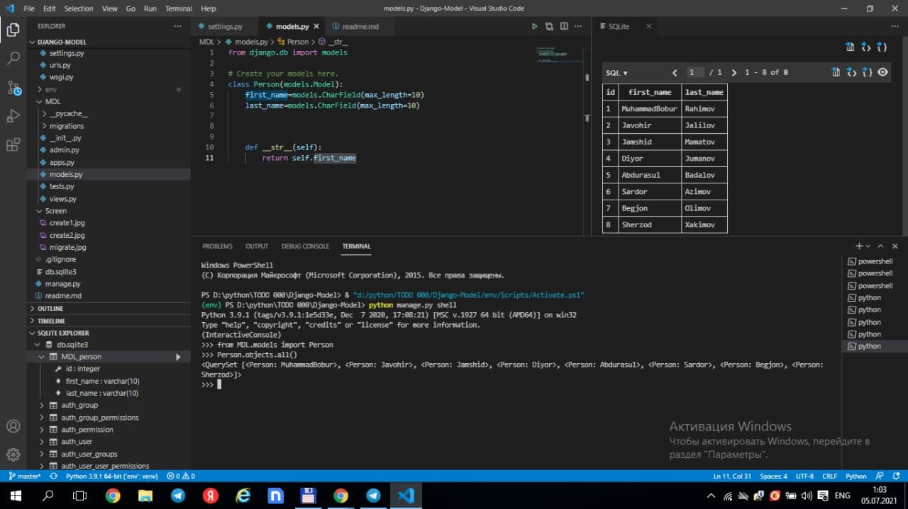

# This exemle is a Django-models

## **Install:**

`pip install django`

***
####1. Django-admin startproject config .
####2. python manage.py startapp MDL

## **Settings:**

`INSTALLED_APPS`
####registration : ' MDL.apps.MdlConfig '

## **Models:**
`1. create class Person`
`2. python mange.py makemigrations`
`3. python mange.py migrate`

## **Methods of database input :**
#### paython manage.py shell

 `1. person1 = Person(first_name = " ",last_name = " ")`
 `person1.save()`
 
 
 
 `2. Person.objects.create(first_name = " ",last_name = " ")`
 
 

 ## **TO READ METHODS**
 
 `Person.objects.all()`
 
 

 ## **FILTER METHODS**

 `Person.objects.filter( last_name = " ")`

 